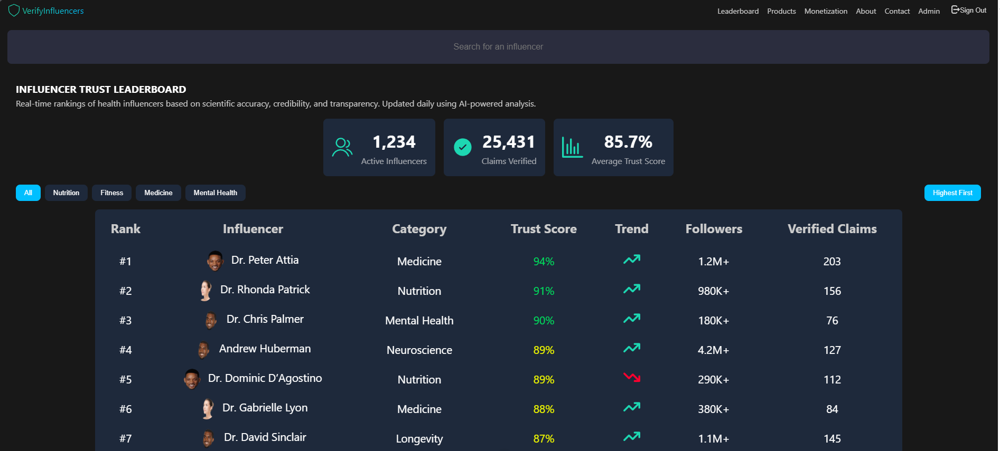
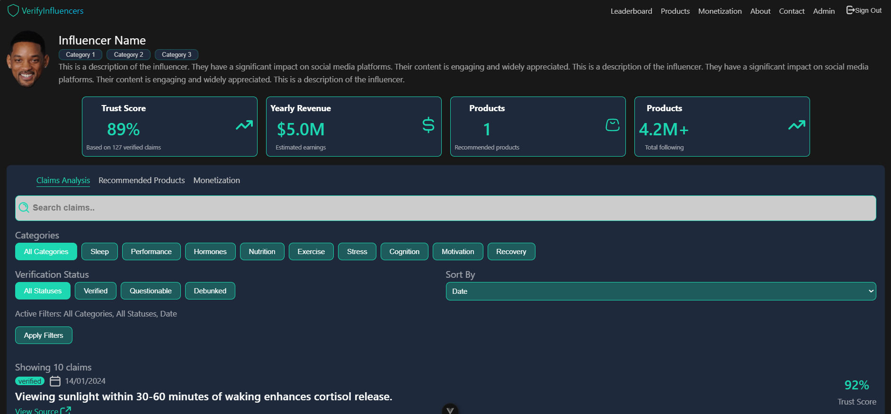
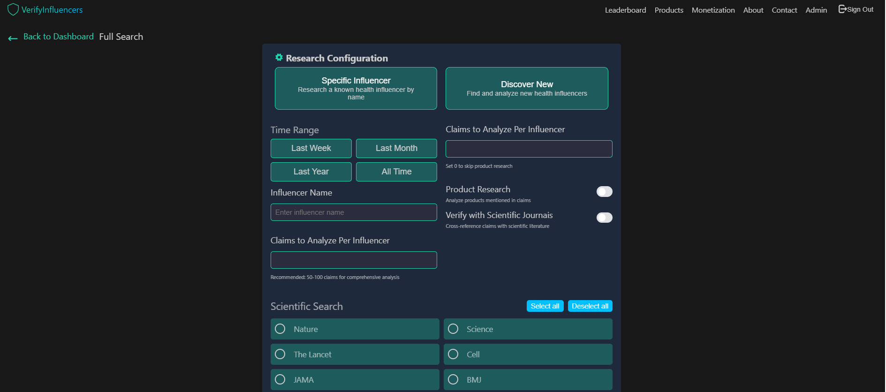

# Vue Infboard
### Data visualization project from Twitter for measuring Digital Influencers and News Portals.

The VUE-INFBOARD frontend was created for visualization and interaction with the Django backend available at: https://github.com/tdiascontato/django-infboard
The project includes mocked data in case the official environment variables are not present in the backend.
Future tasks for the project include typing search functions, distributing components in the atomic model, and creating navigation pages.
The project is configured with Docker. Simply clone the repository, build the image, and start the container. Even without a database connection, you will be able to see the project.



By setting the environment variables in the backend, you will be able to start populating the database through the input on the home page!
## Running the project with Docker

### Steps to run the project

1. Build the Docker image:

    ```sh
    docker build -t vue-infboard .
    ```

2. Run the container:

    ```sh
    docker run -p 5173:80 vue-infboard
    ```

3. Access the application in the browser:

    Open the browser and go to `http://localhost:5173`



